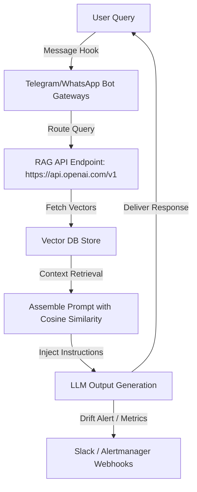

# 👁️ WebWatcher

> BeautifulSoup crawler checking site ETag updates and enqueueing changed files for re-indexing.

[](LICENSE)
[]()

---

### ⚠️ Legal Disclaimer
*This repository contains generic open-source SRE configurations and developer integration templates. Any references to third-party services, APIs, or trademarks (including WhatsApp, Telegram, Slack, AWS, Azure, GCP, SEBI, or RBI) are for compatibility reference, modular integrations, and educational purposes only. This project is not officially affiliated with, endorsed by, or associated with any of the trademark owners.*

---

## 🎛️ How It Works
Open the **[Interactive Studio](https://pradeeptalari14.github.io/portfolio/tools/webwatcher/)** in your portfolio dashboard to customize options, select webhook notification channels (Slack/Teams), toggle chat bot connections (WhatsApp Business/Telegram Bot), and download compiled deployment scripts dynamically.

---

## 🏗️ Architecture Flow Diagram




## 🚀 Step-by-Step Onboarding & Validation Guide

Follow these SRE steps to deploy, validate, and monitor this repository's workspace configs in a local or production environment:

#### 1. Prerequisites
- [x] **Python 3.10+ or Node.js environment**
- [x] **Docker & Docker Compose**
- [x] **GitHub CLI (gh) & Git CLI**
- [x] **Local messaging credentials (WhatsApp Business API / Telegram bot token)**

#### 2. Download
Clone this repository locally:
```bash
git clone https://github.com/Pradeeptalari14/tp-webwatcher.git
cd tp-webwatcher
```

#### 3. Install
Fetch required packages and compile environment dependencies:
```bash
pip install -r requirements.txt || npm install
```

#### 4. Enable Automatic Sidecar Injection
Configure a lightweight logging sidecar container (e.g., fluent-bit or a telemetry daemon) to forward model metrics and catch active failures.

#### 5. Install Kubernetes Gateway API CRDs
Configure a gateway routing rule to load balance prompt traffic and split queries:
```bash
kubectl apply -f https://raw.githubusercontent.com/kubernetes-sigs/gateway-api/v1.1.0/config/crd/standard/gateway-api-v1.1.0-experimental.yaml
```

#### 6. Deploy Application Workload
Launch the target service:
```bash
# Start Docker compose stack
docker compose up -d
```

#### 7. Validate Application Inside Cluster
Validate that the primary configuration is active and healthy:
```bash
bash scripts/validate.sh
```

#### 8. Expose Application Using Gateway
Forward local service ports to preview the chat or prompt API endpoints:
```bash
kubectl port-forward deployment/tp-webwatcher 8080:8080 || echo "Port forwarding enabled on localhost:8080"
```

#### 9. Access the Application
Interact with the chatbot client or retrieve response logs at `http://localhost:8080`.

#### 10. Install Addons
Initialize observability addons like Prometheus scrapers, OpenTelemetry exporters, and tracer proxies.

#### 11. Access Dashboard
Track active prompt runs, input query volumes, and model latency metrics on port `9090` (Prometheus) or `3000` (Grafana).

#### 12. View Service Mesh Graph
Generate visual telemetry graphs to track prompt query flow paths and vector DB hits.

#### 13. Generate Traffic
Dispatch a traffic loop to evaluate the API routing performance under stress:
```bash
for i in {1..10}; do curl -X POST -d '{"query": "health check"}' http://localhost:8080/query || true; sleep 0.2; done
```

#### 14. Project Structure
```text
tp-webwatcher/
├── LICENSE                   # MIT Open Source License
├── README.md                 # Project learning guide & onboarding
├── .env.example              # Template parameters config
├── docs/
│   └── sre_architecture_flow.png # Category SRE architecture diagram
├── scripts/
│   └── validate.sh           # Local validation helper script
└── primary_config/
    └── url_watcher.py     # Main configuration file
```

#### 15. Observability Components
Scrape metrics on token limits, context sizes, prompt delivery rates, and API errors.

#### 16. Install Monitoring
Configure Slack webhooks, Telegram chat IDs, or WhatsApp notification thresholds to capture model downtime immediately.


---
*Generated by [WebWatcher Studio](https://pradeeptalari14.github.io/portfolio/tools/webwatcher/) — [Talari Pradeep SRE Portfolio](https://pradeeptalari14.github.io/portfolio)*
